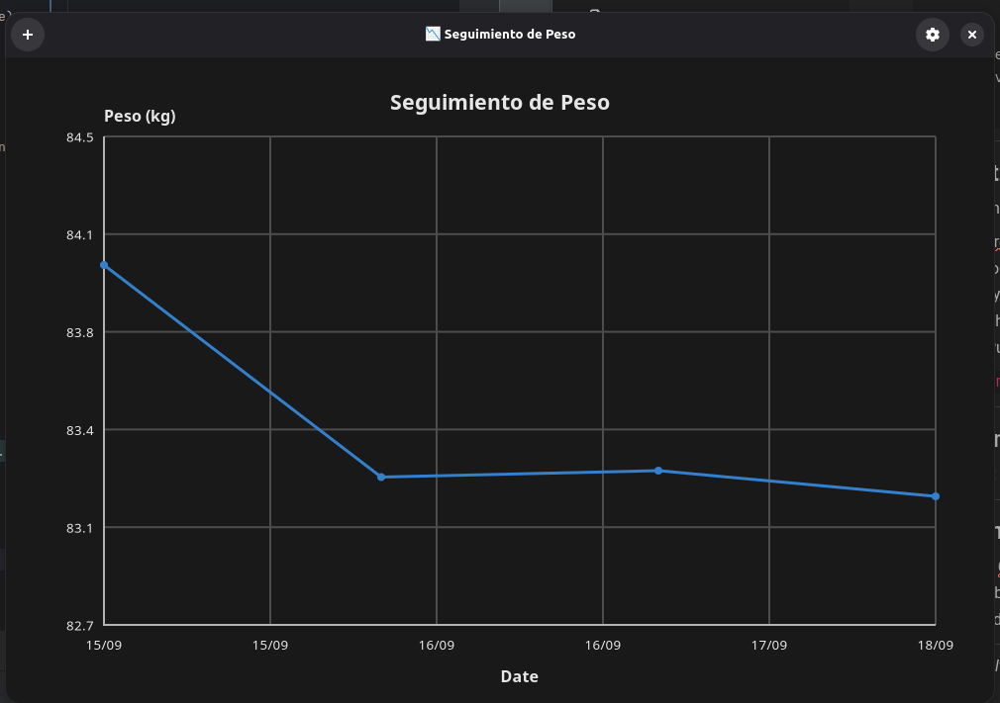

# Health Control Center 🩺📊

A lightweight desktop application to track personal health metrics over time, starting with weight. Built with Python, GTK 4, and Adwaita for a modern GNOME-native experience.

 <!-- Optional: add a real screenshot -->

Track your progress visually with interactive charts, manage data files, and stay in control of your health — all from a clean, intuitive interface.

---

## ✨ Features

- 📈 Interactive time-series chart (weight vs date)
- 🖱️ Hover tooltips showing exact values
- ➕ Add new entries with a clean date picker
- 🔧 Configure data file path via settings
- 💾 Auto-saves to CSV
- 🌗 Supports dark mode (GTK theme aware)
- 🐍 Modern Python with type hints, ruff, mypy, and pytest

---

## 🚀 Quick Start

### Prerequisites

- Python 3.8+
- GTK 4 + PyGObject (`PyGObject`)
- `make` (optional, for convenience)

On Ubuntu/Debian:
```bash
sudo apt install python3-gi python3-gi-cairo gir1.2-adwaita-1 gir1.2-gtk-4.0
```

On Fedora:
```bash
sudo dnf install gtk4-devel libadwaita-devel
```

---

### Installation

```bash
git clone https://github.com/vmgabriel/health_control_center.git
cd health_control_center

# Install dependencies and setup editable package
make dev
```

> Uses Hatch for environment management. No need to create a virtualenv manually.

---

## ▶️ Usage

### Run the GUI App
```bash
make run
```

Or directly:
```bash
hatch run gtk:run
```

### Available Commands
| Command | Description |
|--------|-------------|
| `make dev` | Setup development environment |
| `make run` | Launch the GUI app |
| `make lint` | Check code style with ruff |
| `make fix` | Auto-fix linting issues |
| `make type-check` | Run mypy type checking |
| `make test` | Run unit tests |
| `make cov` | Run tests with coverage |
| `make clean` | Clean build/cache files |

---

## 🧩 Project Structure

```
src/
├── health_control_chackra/
│   ├── __main__.py            # Entry point
│   ├── ui/                    # GTK UI components
│   ├── chart/                 # Reusable time-series chart
│   ├── dialog/                # Dialogs (add, config)
│   └── domain/                # Data repositories (CSV, JSON)
```

All core logic is decoupled from the UI for reusability.

---

## 🛠️ Development

### Running Tests
```bash
make test
make cov
```

### Type Checking & Linting
```bash
make lint
make type-check
make check  # Both
```

### Regenerate Environment
```bash
make clean-env
make dev
```

---

## 🤝 Contributing

Contributions are welcome! Whether it's bug reports, feature requests, or pull requests.

1. Fork the repo
2. Create your feature branch (`git checkout -b feat/new-feature`)
3. Commit your changes (`git commit -m 'Add some feature'`)
4. Push to the branch (`git push origin feat/new-feature`)
5. Open a Pull Request

Please run `make check` before submitting.

---

## 📄 License

This project is licensed under the **MIT License** - see the [LICENSE](LICENSE) file for details.

---

## 🙌 Acknowledgments

- Built with [GTK 4](https://docs.gtk.org/gtk4/) and [Adwaita](https://gnome.pages.gitlab.gnome.org/libadwaita/doc/main/)
- Powered by [Hatch](https://hatch.pypa.io/) for packaging
- Formatted with [ruff](https://beta.ruff.rs/docs/) and type-checked with [mypy](https://mypy-lang.org/)

---

💡 *Stay healthy. Stay in control.*